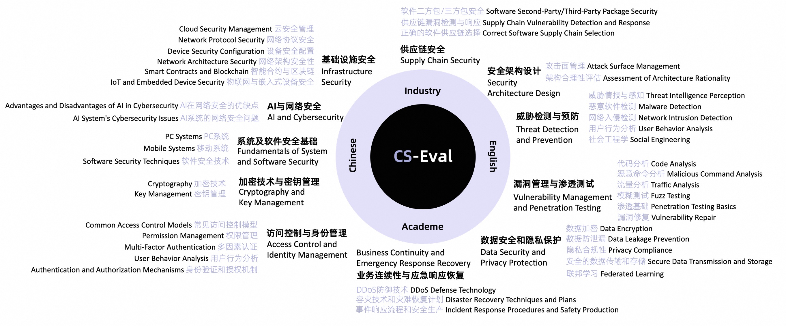

<p align="center">        </p>

<p align="center">
   🌐 <a href="https://cs-eval.com/" target="_blank">Website</a> ｜ 🤗 <a href="https://huggingface.co/datasets/cseval/cs-eval" target="_blank">Hugging Face</a> • 🤖️ <a href="https://modelscope.cn/datasets/cseval/cs-eval/summary" target="_blank">ModelScope</a><br> <a href="https://github.com/CS-EVAL/CS-Eval/blob/main/README.md">English | <a href="https://github.com/CS-EVAL/CS-Eval/blob/main/README_zh.md">中文</a>
</p>
CS-Eval is a comprehensive evaluation toolkit for fundamental cybersecurity models or large language models' cybersecurity ability, encompassing 11 major cybersecurity categories, 42 subdomains, featuring 4,369 assessment items across multiple-choice, true/false, and knowledge extraction questions. It delivers a balanced mix of knowledge-oriented and practice-focused evaluation tasks. The platform empowers users to conduct self-assessments and offers leaderboards across various subdomains, fostering competitive benchmarking and performance insights.




## News

- **[2024.05.xx]** CS-Eval has been released, and users are now able to submit evaluations on the website independently. 🎉🎉🎉
- **[2024.03.29]** The CS-Eval dataset has been jointly constructed and completed. ✅✅✅


## Table of Contents

- [Leaderboard](#leaderboard)

- [Data](#data)
- [CS-Eval Usage Steps](#cs-eval-usage-steps)
- [How to Submit](#how-to-submit)
- [Licenses](#licenses)
- [Citation](#citation)
- [Disclaimer](#disclaimer)


## Leaderboard

Here are the accuracies obtained when evaluating industry-leading models upon our initial release. Please refer to our official platform's Leaderboard for the latest community rankings and also pay attention to rankings within different subdomains. Note that subtle differences may exist in the results for the same model due to variations in its generation config.

| Model                    | Overall Score | AI & Cybersecurity | Business Continuity & Emergency Response & Recovery | Supply Chain Security | Cryptography Techniques & Key Management | Infrastructure Security | Threat Detection & Prevention | Secure Architecture Design | Data Security & Privacy Protection | Vulnerability Management & Penetration Testing | System Security & Software Security Fundamentals | Access Control & Identity Management | Chinese Questions | English Questions |
| ------------------------ | ------------- | ------------------ | --------------------------------------------------- | --------------------- | ---------------------------------------- | ----------------------- | ----------------------------- | -------------------------- | ---------------------------------- | ---------------------------------------------- | ------------------------------------------------ | ------------------------------------ | ----------------- | ----------------- |
| GPT4-8K                  | 87.57         | 91.58              | 84.28                                               | 89.30                 | 86.51                                    | 88.83                   | 85.21                         | 83.90                      | 86.90                              | 89.63                                          | 90.00                                            | 86.56                                | 87.96             | 82.19             |
| GPT3.5-Turbo-16K         | 80.59         | 80.69              | 81.27                                               | 88.96                 | 69.59                                    | 83.17                   | 79.52                         | 76.59                      | 82.14                              | 80.71                                          | 80.00                                            | 78.31                                | 80.62             | 80.14             |
| Qwen-14B-Chat            | 79.04         | 87.13              | 78.60                                               | 87.63                 | 68.49                                    | 81.33                   | 79.67                         | 74.15                      | 76.68                              | 77.80                                          | 77.00                                            | 78.89                                | 79.99             | 65.41             |
| Qwen1.5-14B-Chat         | 76.66         | 78.71              | 70.23                                               | 81.27                 | 76.13                                    | 78.00                   | 77.53                         | 70.73                      | 77.58                              | 75.77                                          | 75.33                                            | 77.59                                | 76.68             | 75.68             |
| Qwen1.5-MoE-A2.7B-Chat   | 74.63         | 74.75              | 72.24                                               | 81.94                 | 73.50                                    | 71.88                   | 76.61                         | 68.78                      | 70.24                              | 74.80                                          | 74.33                                            | 79.50                                | 75.99             | 55.14             |
| Baichuan2-13B-Chat       | 73.92         | 76.24              | 73.91                                               | 80.27                 | 60.09                                    | 76.50                   | 76.94                         | 71.71                      | 75.69                              | 70.55                                          | 70.67                                            | 73.90                                | 73.79             | 75.34             |
| 360Zhinao-7B-Chat-4K     | 66.37         | 71.29              | 66.33                                               | 70.00                 | 51.04                                    | 66.78                   | 68.63                         | 68.78                      | 65.02                              | 64.78                                          | 67.67                                            | 68.14                                | 66.68             | 61.99             |
| Mistral-7B-Instruct-v0.2 | 65.93         | 69.31              | 63.67                                               | 72.76                 | 57.78                                    | 70.43                   | 64.40                         | 62.44                      | 63.44                              | 63.71                                          | 63.67                                            | 69.54                                | 66.01             | 63.36             |
| Yi-6B-Chat               | 65.27         | 65.84              | 59.67                                               | 72.76                 | 68.80                                    | 64.84                   | 63.85                         | 60.00                      | 62.85                              | 64.68                                          | 63.00                                            | 69.98                                | 65.58             | 59.93             |
| ChatGLM3-6B              | 57.33         | 65.35              | 56.67                                               | 68.44                 | 47.78                                    | 59.87                   | 61.47                         | 61.46                      | 57.71                              | 50.81                                          | 50.33                                            | 55.26                                | 57.14             | 59.25             |
| SecGPT-13B               | 47.34         | 40.59              | 45.33                                               | 59.14                 | 41.54                                    | 47.60                   | 47.34                         | 45.85                      | 43.08                              | 46.77                                          | 46.00                                            | 53.15                                | 48.45             | 31.85             |
| Llama-2-13b-chat-hf      | 38.08         | 38.12              | 39.13                                               | 30.43                 | 34.11                                    | 37.67                   | 39.00                         | 37.07                      | 35.52                              | 38.57                                          | 33.33                                            | 47.60                                | 38.40             | 32.88             |


## Data

#### Download

- Method 1: Download or load on [Hugging Face](https://huggingface.co/datasets/cseval/cs-eval):

  - Download data directly:
  
  ```
    wget https://huggingface.co/datasets/cseval/cs-eval/resolve/main/cs-eval-questions.zip
  ```
  
  - Load dataset using Hugging Face datasets:
  
  ```
  from datasets import load_dataset
  dataset=load_dataset(r"cseval/cs-eval")
  
  print(dataset['{test}'][0])
  ```

- Method 2: Download on [ModelScope](https://modelscope.cn/datasets/cseval/cs-eval/summary):

  - Download data directly:

  ```
  git clone https://www.modelscope.cn/datasets/cseval/cs-eval.git
  ```

  - Load dataset using Model Scope SDK:

  ```
  from modelscope.msdatasets import MsDataset
  ds =  MsDataset.load('cseval/cs-eval')
  ```


## CS-Eval Usage Steps

1. Download the CS-Eval evaluation data from either Hugging Face or ModelScope.
2. Adapt the model inference format.
3. Conduct model inference on the CS-Eval evaluation dataset.
4. Format the inference results according to the specified submission guidelines.
5. Submit the model results to the CS-Eval platform.
6. Obtain the evaluation results on the platform.
7. Decide whether to opt into public leaderboard.


## How to Submit

You need to convert the organized model inference results into a JSON file encoded in UTF-8 and format it according to the following example.
```
## Example
[
    {
      "question_id": "1",
      "answer": "A"
    },
    {
      "question_id": "123",
      "answer": "对"
    },
    {
      "question_id": "1234",
      "answer": "是否涉及漏洞：是\n漏洞号：CVE-2024-22891\n影响的产品及版本：Nteract v.0.28.0"
    }
]
```

In this example, question_id refers to the question number, and answer contains the processed model output.


Please note:

- For multiple-choice questions, the correct answer option(s) can typically be extracted directly from the model's generated result using regular expressions.
- In the case of multiple-answer questions, regular expressions can similarly be used to extract multiple correct answer options from the model's output.
- For true/false questions, if the question instructions require a specific answer format, the judgment result is usually taken from the beginning or end of the model's output.
- For knowledge extraction tasks, where the question specifies a particular response format, use the raw text output from the model inference directly.


When you regularize multiple-choice questions, you can quickly locate multiple-choice questions by filtering the following keywords in the dataset prompt.

```
"单选题："
"多选题："
"Single-choice question:"
```


## Licenses

[](https://lbesson.mit-license.org/)

This project adheres to the [MIT License](https://lbesson.mit-license.org/).

[](http://creativecommons.org/licenses/by-nc-sa/4.0/)

The CS-Eval dataset adheres to the [Creative Commons Attribution-NonCommercial-ShareAlike 4.0 International License](http://creativecommons.org/licenses/by-nc-sa/4.0/).


## Citation

If you utilize our dataset in your research or technical reports, please ensure proper citation.

```bibtex
@misc{2024cseval,
    title={CS-Eval: A Comprehensive Evaluation Toolkit for Fundamental CyberSecurity Models},
    author={*Zeng, Jiutian and *Yu, Zhengmin and Chen, Siyi and Xu, Wenhan and Xu, Dandan and Liu, Xiangyu and Lu, Yining and Zhang, Yuan},
    publisher = {GitHub},
    howpublished= "https://github.com/CS-EVAL/CS-Eval",
    year={2024}
}
```


## Disclaimer

Our platform and its affiliated entities consistently adhere to principles of legality, compliance, positivity, and health, dedicated to promoting the research and application of large language models in the field of cybersecurity to enhance protective capabilities. To prevent any potential misunderstanding of the content on this platform, we hereby issue the following statement:

1. Legitimate Purposes: All information, resources, tools, and services we provide are intended to facilitate lawful and beneficial activities in the cybersecurity sector, including scientific research, technological innovation, risk assessment, and the formulation of defensive strategies using large models. We firmly oppose any utilization of large language models for illegal activities, infringement, or compromising cybersecurity.
1. Non-Inducement: This platform strictly prohibits any content that incites or encourages others to engage in cyberattacks, intrusions, disruptions, or unauthorized data acquisition. We emphasize that all content related to large language model cybersecurity evaluation sets aims to advance industry development, provide cybersecurity system evaluations, and facilitate technical exchanges, devoid of any elements that induce, encourage, or imply malicious attacks.
1. Non-Malicious Attack Education: We explicitly state that our provided content does not involve teaching, demonstrating, or guiding techniques for malicious cyberattacks. All discussions involving offensive actions are strictly confined within the realms of legitimate cybersecurity drills, vulnerability research, and risk assessments, aimed at enhancing defensive capabilities rather than offensive purposes.
1. User Responsibility: Users must strictly abide by relevant laws and regulations when using our platform's services and are prohibited from utilizing platform resources for any illegal, infringing, or cybersecurity-compromising activities. In the event of user violations, our platform reserves the right to take measures including but not limited to warnings, service suspension, account banning, and the pursuit of legal responsibility.
1. Disclaimer: While we strive to ensure the accuracy, legality, and appropriateness of our platform's content, users are solely responsible for any direct or indirect losses incurred from their own actions during usage, including legal disputes, property loss, data breaches, reputational harm, etc. Neither our platform nor its affiliated entities assume any legal liability. Users should assess and bear all risks associated with using platform resources themselves.


We sincerely call upon all users to jointly maintain a sound order in the cybersecurity domain, employing large model technologies and related resources legally, rationally, and responsibly. The final interpretation right of this disclaimer resides with our platform, and changes, if any, will not be separately notified.

