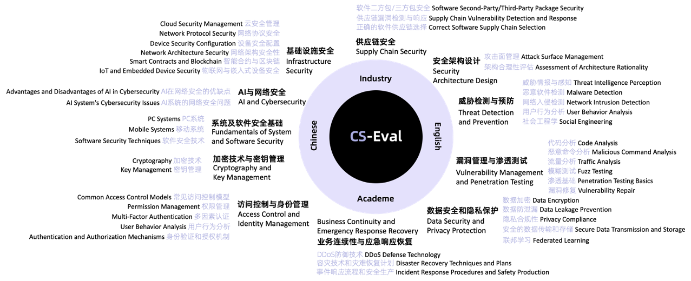

<p align="center">        </p>

<p align="center">
   🌐 <a href="https://cs-eval.com/" target="_blank">评测网站</a> ｜ 🤗 <a href="https://huggingface.co/datasets/cseval/cs-eval" target="_blank">Hugging Face</a> • 🤖️ <a href="https://modelscope.cn/datasets/cseval/cs-eval/summary" target="_blank">ModelScope</a><br> <a href="https://github.com/CS-EVAL/CS-Eval/blob/main/README.md">English | <a href="https://github.com/CS-EVAL/CS-Eval/blob/main/README_zh.md">中文</a>
</p>


CS-Eval 是网络安全基础模型综合评测套件，覆盖了11个网络安全大类领域、42个子类领域的4369个多项选择题、判断题、知识抽取题，提供偏知识型和偏实战型的综合评估任务。平台支持用户自主评测，并提供不同子领域的排行。



## 更新

- **[2024.05.xx]** CS-Eval已正式发布，用户可自主在网站提交评估。🎉🎉🎉 

- **[2024.03.29]** CS-Eval数据集已联合构建完成。✅✅✅


## 目录

- [排行榜](#排行榜)

- [数据](#数据)
- [CS-Eval使用步骤](#CS-Eval使用步骤)
- [如何提交](#如何提交)
- [Licenses](#licenses)
- [引用](#引用)
- [免责声明](#免责声明)


## 排行榜

以下是我们在初次公开发布之际，对业界一系列前沿模型所进行的精度评估数据。请持续关注CS-Eval官方平台Leaderboard，以便及时获取社区内最新的排名动态。同时，我们也详尽提供了针对各细分应用领域的专项排行榜。鉴于模型推理过程中生成参数设定的多样性，即使是同一模型，在实际运行后所产生的最终表现亦可存在微小的差异。

| 模型名称                 | 综合得分 | AI与网络安全 | 业务连续性与应急响应恢复 | 供应链安全 | 加密技术与密钥管理 | 基础设施安全 | 威胁检测与预防 | 安全架构设计 | 数据安全和隐私保护 | 漏洞管理与渗透测试 | 系统安全及软件安全基础 | 访问控制与身份管理 | 中文题 | 英文题 |
| ------------------------ | -------- | ------------ | ------------------------ | ---------- | ------------------ | ------------ | -------------- | ------------ | ------------------ | ------------------ | ---------------------- | ------------------ | ------ | ------ |
| GPT4-8K                  | 87.57    | 91.58        | 84.28                    | 89.30      | 86.51              | 88.83        | 85.21          | 83.90        | 86.90              | 89.63              | 90.00                  | 86.56              | 87.96  | 82.19  |
| GPT3.5-Turbo-16K         | 80.59    | 80.69        | 81.27                    | 88.96      | 69.59              | 83.17        | 79.52          | 76.59        | 82.14              | 80.71              | 80.00                  | 78.31              | 80.62  | 80.14  |
| Qwen-14B-Chat            | 79.04    | 87.13        | 78.60                    | 87.63      | 68.49              | 81.33        | 79.67          | 74.15        | 76.68              | 77.80              | 77.00                  | 78.89              | 79.99  | 65.41  |
| Qwen1.5-14B-Chat         | 76.66    | 78.71        | 70.23                    | 81.27      | 76.13              | 78.00        | 77.53          | 70.73        | 77.58              | 75.77              | 75.33                  | 77.59              | 76.68  | 75.68  |
| Qwen1.5-MoE-A2.7B-Chat   | 74.63    | 74.75        | 72.24                    | 81.94      | 73.50              | 71.88        | 76.61          | 68.78        | 70.24              | 74.80              | 74.33                  | 79.50              | 75.99  | 55.14  |
| Baichuan2-13B-Chat       | 73.92    | 76.24        | 73.91                    | 80.27      | 60.09              | 76.50        | 76.94          | 71.71        | 75.69              | 70.55              | 70.67                  | 73.90              | 73.79  | 75.34  |
| 360Zhinao-7B-Chat-4K     | 66.37    | 71.29        | 66.33                    | 70.00      | 51.04              | 66.78        | 68.63          | 68.78        | 65.02              | 64.78              | 67.67                  | 68.14              | 66.68  | 61.99  |
| Mistral-7B-Instruct-v0.2 | 65.93    | 69.31        | 63.67                    | 72.76      | 57.78              | 70.43        | 64.40          | 62.44        | 63.44              | 63.71              | 63.67                  | 69.54              | 66.01  | 63.36  |
| Yi-6B-Chat               | 65.27    | 65.84        | 59.67                    | 72.76      | 68.80              | 64.84        | 63.85          | 60.00        | 62.85              | 64.68              | 63.00                  | 69.98              | 65.58  | 59.93  |
| ChatGLM3-6B              | 57.33    | 65.35        | 56.67                    | 68.44      | 47.78              | 59.87        | 61.47          | 61.46        | 57.71              | 50.81              | 50.33                  | 55.26              | 57.14  | 59.25  |
| SecGPT-13B               | 47.34    | 40.59        | 45.33                    | 59.14      | 41.54              | 47.60        | 47.34          | 45.85        | 43.08              | 46.77              | 46.00                  | 53.15              | 48.45  | 31.85  |
| Llama-2-13b-chat-hf      | 38.08    | 38.12        | 39.13                    | 30.43      | 34.11              | 37.67        | 39.00          | 37.07        | 35.52              | 38.57              | 33.33                  | 47.60              | 38.40  | 32.88  |


## 数据

#### 下载

- 方法一：在[Hugging Face](https://huggingface.co/datasets/cseval/cs-eval)直接下载或使用接口加载数据集：

  - 直接下载：
  
  ```
    wget https://huggingface.co/datasets/cseval/cs-eval/resolve/main/cs-eval-questions.zip
  ```
  
  - 使用Hugging Face datasets加载数据集。示例如下:
  
  ```
  from datasets import load_dataset
  dataset=load_dataset(r"cseval/cs-eval")
  
  print(dataset['{test}'][0])
  ```
  
- 方法二：在[Model Scope](https://modelscope.cn/datasets/cseval/cs-eval/summary)上下载：

  - 直接下载：

  ```
  git clone https://www.modelscope.cn/datasets/cseval/cs-eval.git
  ```

  - 使用Model Scope SDK来加载数据：

  ```
  from modelscope.msdatasets import MsDataset
  ds =  MsDataset.load('cseval/cs-eval')
  ```


## CS-Eval使用步骤

1. 在Hugging Face或ModelScope上下载CS-Eval评估数据
2. 适配模型推理格式
3. 模型推理
4. 整理推理结果格式
5. 在CS-Eval平台上提交模型结果
6. 获取评测结果
7. 选择是否参与公开排行


## 如何提交

您需要将整理后的模型推理结果转换成UTF-8编码的JSON文件，并按照以下格式编写。

```
## 示例
[
    {
      "question_id": "1",
      "answer": "A"
    },
    {
      "question_id": "123",
      "answer": "对"
    },
    {
      "question_id": "1234",
      "answer": "是否涉及漏洞：是\n漏洞号：CVE-2024-22891\n影响的产品及版本：Nteract v.0.28.0"
    }
]
```

其中question_id是题号，answer是整理后的模型结果。

请注意：

- 对于单项选择题，通常可以直接从模型的生成结果中使用正则表达式提取出正确答案选项。
- 对于多项选择题，通常可以直接从模型的生成结果中使用正则表达式提取出多个正确答案选项。
- 对于判断题，题目指令中有要求模型回答指定答案，通常可以取模型的首部或尾部的判断结果。
- 对于知识抽取题，题目有要求按照指定格式回答，直接使用模型推理的原始结果文本。


## Licenses

[](https://lbesson.mit-license.org/)

本项目遵循 [MIT License](https://lbesson.mit-license.org/).

[](http://creativecommons.org/licenses/by-nc-sa/4.0/)

CS-Eval数据集遵循 [Creative Commons Attribution-NonCommercial-ShareAlike 4.0 International License](http://creativecommons.org/licenses/by-nc-sa/4.0/).


## 引用

如果您在研究或技术报告等场景使用了我们的数据集，请标明引用。

```bibtex
@misc{2024cseval,
    title={CS-Eval: A Comprehensive Evaluation Toolkit for Fundamental CyberSecurity Models},
    author={Zeng, Jiutian and Yu, Zhengmin and Chen, Siyi and Xu, Wenhan and Xu, Dandan and Liu, Xiangyu and Zhang, Yuan},
    publisher = {GitHub},
    howpublished= "https://github.com/CS-EVAL/CS-Eval",
    year={2024}
}
```


## 免责声明

本平台及关联主体始终坚持合法、合规、积极、健康的宗旨，致力于推动大模型在网络安全领域的研究与应用，提升安全防护能力。为避免公众对本平台内容产生误导，特就此声明如下：

1. 合法目的：我们提供的所有信息、资源、工具及服务，旨在促进大模型技术在网络安全领域的科学研究、技术创新、风险评估、防御策略制定等合法、有益活动，坚决反对任何利用大模型从事违法、侵权或破坏网络安全的行为。
2. 非诱导性：本平台严格禁止任何诱导、教唆他人实施网络攻击、入侵、破坏、非法获取数据等非法行为的内容。我们强调，所有与网络安全大模型评测集相关的内容均以促进行业发展、提供网络安全系统评测和促进技术交流为目的，不含有任何诱导、鼓励或暗示实施恶意攻击的成分。
3. 非恶意攻击教学：本平台明确声明，我们提供的所有内容均不涉及教授、演示或指导实施恶意网络攻击的技术手段，所有涉及攻击性的讨论均严格限定在合法的网络安全攻防演练、漏洞研究、风险评估等范畴内，旨在提高防御能力，而非用于攻击性目的。
4. 用户责任：用户在使用本平台服务过程中，必须严格遵守相关法律法规，不得利用平台资源进行任何违法、侵权或破坏网络安全的活动。对于用户违反本声明的行为，本平台有权采取包括但不限于警告、暂停服务、封禁账号等措施，并保留依法追究其法律责任的权利。
5. 免责声明：尽管我们努力确保平台内容的准确、合法、适宜，但用户在使用过程中，因自身行为导致的任何直接或间接损失，包括但不限于法律纠纷、财产损失、数据泄露、声誉损害等，本平台及关联主体不承担任何法律责任。用户应自行判断并承担使用平台资源可能产生的全部风险。


我们真诚呼吁广大用户共同维护网络安全领域的良好秩序，合法、理性、负责任地使用大模型技术及相关资源。本免责声明的最终解释权归本平台所有，如有变动，恕不另行通知。
